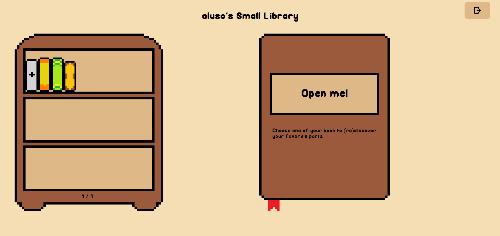
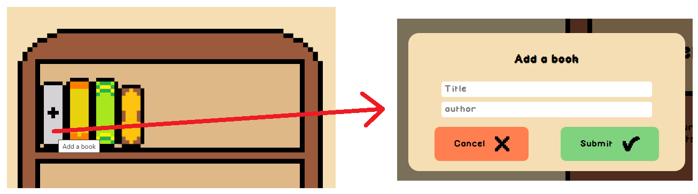
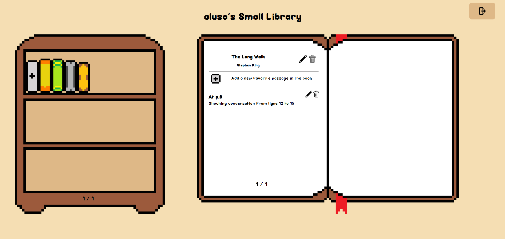
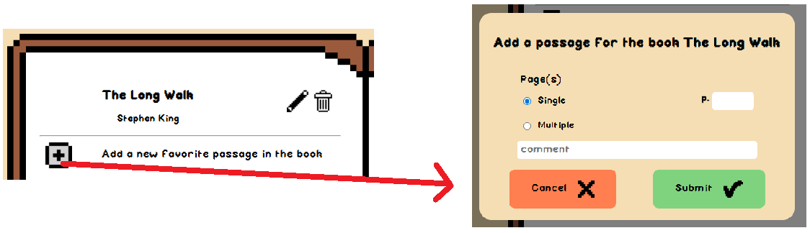

# My Small Library

## Description
*My Small Library* is a React application designed to register the book you read and wrote some quotations, or favorite passages for each of them.
All the visuals of the app are handmade from the font to the images.

## Access the app
*My Small Library* is available with the following link: [https://dubiefe.github.io/Library/](https://dubiefe.github.io/Library/).
You will need to create an account to use the application.

## Functionnalities


*My Small Library Main View*

### Add books
To add new books in your library, you can click on the gray book with the "+" on the first bookshelf.
A popup will appear with all the info you need to enter on the book.


*My Small Library Add Book*

### Read your favorites passages
To see the passages you have for a specific book, click on it in the bookshelf. 
Then the big book on the right will open.


*My Small Library Open Book View*

### Add a passage
To add new passages in a book, you can click on the gray square with the "+" bellow the title of the book.
A popup will appear with all the info you need to enter on the passage.


*My Small Library Add Passage*

### Update & Delete
Of course, if you make a mistake or you want to delete something you have the possibility.
For the book, you can use the icons next to the title and author in the open book.
For the passages, you can also use the icons next to each passage in the open book.


*My Small Library Update Delete*

## Structure of the project

### Simplified Tree
```
Library
├── README.md
├── Library_Backend
│   ├── library_backend.js
│   └── login_backend.js
└── Library_Frontend
    ├── index.html
    ├── public
    │   └── library.png
    └── src
        ├── App.css
        ├── App.jsx
        ├── index.css
        ├── main.jsx
        ├── assets
        │   ├── font
        │   └── images
        ├── book
        │   ├── book.css
        │   ├── closed_book_component
        │   └── opened_book_component
        ├── button_component
        ├── library_component
        ├── passage_component
        ├── pop_ups
        │   ├── popup.css
        │   ├── popup_add_update_book_component
        │   ├── popup_add_update_passage_component
        │   ├── popup_delete_component
        │   └── popup_login_component
        └── single_book_component
```

### Backend
The backend is hosted on CloudFare.

The database consists of a table with two lines: 

    - one for a json with all the user's info;

    - one for all the libraries.

The database is accessible thanks to a worker.

Then, to access it easily in the app, two class files are exporting classes to interact with clouddare, with all the necessary functions.

### Frontend
The frontend is made using React, alongside with Formik and Yup for the forms. 

## Author
*Emilie Dubief*